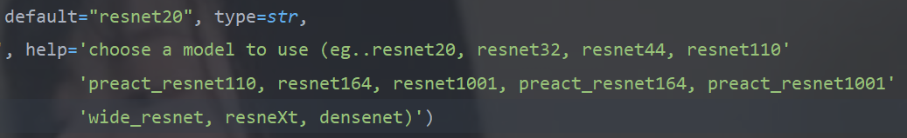
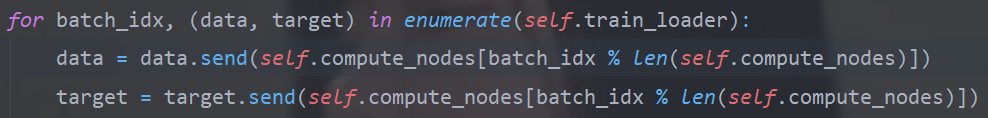
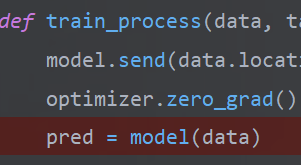

# Experiments on CIFAR & MNIST datasets with gradient encryption.

## Introduction

The model is built for safe deep learning gradient encryption aggregation experiments on the cifar100 dataset by using [PySyft framework](https://github.com/OpenMined/PySyft). This realizes to use differential dataset training on the independent models then all parameters will be encrypted aggregation into specifical parameters container. Finally, the models upload parameters after gradients of each model be encrypted and aggregate together.

Reimplement state-of-the-art CNN models in Cifar100 dataset with Pysyft, now including:
* For cifar100 dataset:

    1.[ResNet](https://arxiv.org/abs/1512.03385v1)
    
    2.[PreActResNet](https://arxiv.org/abs/1603.05027v3)
    
    3.[WideResNet](https://arxiv.org/abs/1605.07146v4)
    
    4.[ResNeXt](https://arxiv.org/abs/1611.05431v2)
    
    5.[DenseNet](https://arxiv.org/abs/1608.06993v4)

    6.[Alexnet](https://arxiv.org/ftp/arxiv/papers/1803/1803.01164.pdf)

* For Mnist dataset:

    7.[Lenet](https://arxiv.org/pdf/1909.12778.pdf)

other results will be added later.

## Requirements:software

Requirements for [PyTorch](http://pytorch.org/)

And others package must be included in your environment specified in requirements.txt

## Requirements:hardware

For now only can run on CPU.

## Usage

1. Clone this repository

```
git clone https://github.com/Gaopeng-Bai/pytorch-syft-cifar-model.git
```

In this project, the network structure is defined in the "models" folder, the script ```secure_gradient.py``` is running on two separates models, gradient aggregation though Syft virtual machine. Then upload new parameters after aggregation to each model.

* In ```secure_gradient.py```, **Mnist** dataset can train on ``lenet5``, ``simply_cnn``.  but ``AlexNet`` model testing with Tiny ImageNet or MNIST could not be done due to their smaller feature sizes (images do not fit the input size 227 x 227). Mnist on ``lenet5`` model tested on learning rate 0.01 and epoch 15 reached 99% accuracy, and on simply_cnn spent more time than ``lenet5``.

* **cifar100** dataset can train on ``resnet20``, ``resnet32``, ``resnet44``, ``resnet110``, ``preact_resnet110``, ``resnet164``, ``resnet1001``, ``preact_resnet164``, ``preact_resnet1001``,``wide_resnet``, ``resneXt``, ``densenet``.

2. Edit syft_main.py relevant parameters of model

In the ```secure_gradient.py```, you can specify the model you want to train(for example):


Then, you need specify some parameter for training process, like epoche....

3. Train

* Two local worker with gradient aggregation

    ```
    python secure_gradient.py
    ```

* Normal Model 

    ```
    python Cifar100_main.py

    python mnist_main.py
    ```

4. Extension (For fun)

In the  ```syft_test.py```, it is a cifar100 secure gradient aggregation model modified completely according to [Syft tutorials 10](https://github.com/OpenMined/PySyft/blob/master/examples/tutorials/Part%2010%20-%20Federated%20Learning%20with%20Secure%20Aggregation.ipynb).   However, it's not working. Because when the data send to virtual machine (bob and alice). 

In the training, the model point the data position, input data to the current model point suddenly, it broken here. 


Don't know the reason why this happen yet. It seem like some wrong in [PySyft framework](https://github.com/OpenMined/PySyft).  
